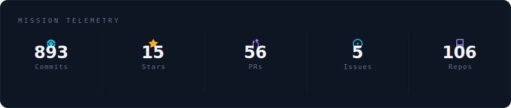

<!-- Galaxy Profile README Template
     Customize this file with your own info, then rename it to README.md
     in your GitHub profile repo (github.com/YOUR_USERNAME/YOUR_USERNAME).
     The SVG paths below point to assets/generated/ which are auto-generated
     by the GitHub Actions workflow or by running: python -m generator.main -->

  

 

  

 

  

 

  

 

<strong>More about me</strong>

 

User-centered solutions that prioritize the person who matters most — the user.
Full Stack Developer with a front-end focus, building scalable platforms for
customer service and marketing. Strong background in software architecture,
technical quality, and performance-driven development.

Currently studying Analysis and Systems Development and pursuing a Lato Sensu
MBA in Software Architecture.

**Currently at** Bosch Service Solutions — Joinville, SC

 

  
  
  

